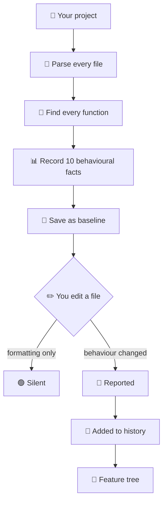

<div align="center">

# PlanMap

### Reads your codebase, learns what every function does,<br>and tracks how it changes.

Local · no rules to write · no spec to maintain · works on any repo

[](LICENSE)
[](https://nodejs.org)
[](#what-gets-tracked)
[](#status)

</div>

<div align="center">

---

## Two things it does

</div>

<table>
<tr>
<td width="50%" valign="top">

### 🔴 Detects behavioural change

Not "this file changed" — **this function stopped throwing**.

Reformat or rename → silent.
Remove error handling → reported.

</td>
<td width="50%" valign="top">

### 🌲 Builds a feature history

Turns those changes into a readable tree, grouped by
**what the feature does** — not which folder it's in.

</td>
</tr>
</table>

<div align="center">

---

## The change that started this

</div>

```diff
  function validateScore(raw) {
-   if (raw == null) throw new ValidationError('score required');
+   if (raw == null) return null;
    return Number(raw);
  }
```

<div align="center">

**Compiler passed · Tests passed · ESLint passed · AI review said nothing**

Every caller that relied on catching that error now silently receives `null`.
Nothing crashes. The behaviour is just wrong from here on.

---

## Install

</div>

```bash
npx planmap init        # learn the codebase
npx planmap watch       # report behavioural changes as they happen
npx planmap evolution   # build the feature tree
```

<div align="center">

**No API key · No account · No config · Nothing leaves your machine**

---

## How it works

</div>



<div align="center">

---

## What it looks like

</div>

**Behavioural change detected**

```console
src/auth/token.ts::verifyToken:function CHANGED
    throws           1 → 0
    throwTypes       [AuthError] → []
    returnsNullish   0 → 1
```

**Feature history** — `planmap evolution`

```markdown
- **Login**
  - Added authentication start endpoint  `backend` `api`
    - Updated authentication response status
      - numbers [200,401] → [200,402]
  - Added JWT verification middleware  `backend` `security`
  - Added Google Sign-In initialization  `frontend`

- **Survey**
  - Added survey start endpoint  `backend` `api`
  - Added survey submission service  `backend` `database`
```

<div align="center">

---

## The Evolution Graph

**What your project actually is — derived from code, not commit messages.**

| Question it answers | |
|:--|:--|
| *"I just joined — what is this?"* | A map of real capabilities |
| *"What does Login contain?"* | Every part of it, across every layer |
| *"How did this get built?"* | Order things appeared, and what changed after |

</div>

Structure comes from **static analysis** — deterministic, no model involved. Labels come from an **LLM**, batched 30 at a time, with vocabulary threading forward so batch 5 reuses batch 1's names. Each batch saves as it completes, so a failure halfway doesn't lose earlier work.

> **Features are capabilities, not layers.** A feature spanning frontend and backend stays **one** node. Grouping by layer would shred Login into Controller, Service, and Middleware — three places, no story.

<div align="center">

**No API key? Still works.** Labels fall back to deterministic values
from the code, and upgrade automatically if you add a key later.

### 🔒 Your source code never leaves your machine

Only extracted facts — `calls: [jwt.sign]`, `numbers: [3600] → [7200]`

---

## What gets tracked

**JavaScript · TypeScript · JSX · TSX** — ten facts per function

| | |
|:--|:--|
| `throws` · `throwTypes` | Error handling removed or changed |
| `returns` · `returnsNullish` | A function that threw now returns nothing |
| `calls` | A dependency added or dropped |
| `numbers` | Limits, timeouts, retries, status codes |
| `awaits` | Sync/async behaviour changed |
| `catches` · `emptyCatches` | Errors newly swallowed |
| `params` | Signature changed |

**String text is not recorded** — error messages get reworded constantly
and would create false alarms.

</div>

<details>
<summary><b>Why facts and not hashes?</b></summary>

<br>

| Edit | Hash | Facts |
|:--|:--:|:--:|
| Reformat | 🔴 fires | 🟢 silent |
| Rename a local | 🔴 fires | 🟢 silent |
| Add a comment | 🔴 fires | 🟢 silent |
| `throw` → `return null` | 🔴 fires | 🔴 `throws: 1 → 0` |

A hash tells you *something* changed. Facts tell you **what**.

</details>

<details>
<summary><b>TypeScript specifics</b></summary>

<br>

`.ts` and `.tsx` use separate grammars — in `.tsx`, `<Foo>` is JSX;
in `.ts` it's a type assertion.

Handled: classes, abstract classes, namespaces, decorators, generics,
overloads, getters and setters, `static` and `#private` members,
parameter properties, `satisfies`, and class fields holding functions.

`.d.ts` files are skipped, as are `dist`, `build`, `out`, and `.next` —
otherwise compiled output gets parsed alongside its source.

</details>

<details>
<summary><b>Commands</b></summary>

<br>

| | |
|:--|:--|
| `init` | Scan the project and write `.planmap/baseline.json` |
| `watch` | Watch files; report changes as they happen |
| `check` | Compare against the baseline. Exits non-zero — usable in CI. |
| `accept` | Approve the current state as the new baseline |
| `diff <a> <b>` | Compare two files directly |
| `evolution` | Render the change history as a feature tree |

**Only `init` and `accept` ever write the baseline.** The watcher never does —
otherwise a change would erase its own evidence.

</details>

<div align="center">

---

## Validated on real code

Run across **9 open-source TypeScript repositories**

**16,328** declarations · **0** identity collisions · **9/9** repos scanned

*TanStack Query · tRPC · Zod · Remeda · type-fest · got · ky · Zustand · ofetch*

A file that fails to parse is skipped and reported — never fatal.

---

## How it compares

| | Linters | AI reviewers | **PlanMap** |
|:--|:--:|:--:|:--:|
| Needs rules | ✅ | ❌ | ❌ |
| Sees between commits | ❌ | ❌ | **✅** |
| Sends code to a server | ❌ | ⚠️ | **❌** |
| Deterministic | ✅ | ❌ | **✅** |
| Builds a feature history | ❌ | ❌ | **✅** |

A pattern-matching scanner catches the example above **only if someone
wrote a rule** saying that function must throw. Nobody writes that rule.

---

## Status

**v0.4** — working, in active development, dogfooded daily

| | |
|:--|:--|
| ✅ | Declaration extraction — JS, TS, JSX, TSX |
| ✅ | Behavioural fact extraction |
| ✅ | Baseline · watch · CI exit codes |
| ✅ | Evolution graph with batched labelling |
| 🔨 | Sessions — group saves into one unit of work |
| 🔨 | Significance — stop reporting removed debug lines |
| 🔨 | Dependency map + impact analysis |
| 📋 | Python |

**Next release** adds the line the tool is missing today

</div>

```console
  3 declarations depend on this:
    loadSession     direct
    createOrder     direct
    handleOrder     via loadSession
```

<div align="center">

---

Node ESM, no build step · [`web-tree-sitter`](https://github.com/tree-sitter/tree-sitter) for parsing · `chokidar` for watching
Storage is plain JSON in `.planmap/`, committable to git

Design decisions and reasoning: [`DECISIONS.md`](DECISIONS.md)

---

## Contributing

Issues welcome — especially

> 🐛 **A behavioural change PlanMap missed**
> 🔇 **A change it reported that didn't matter**

---

<br>

**MIT** · built by [@its-sambhav](https://github.com/its-sambhav)

</div>
