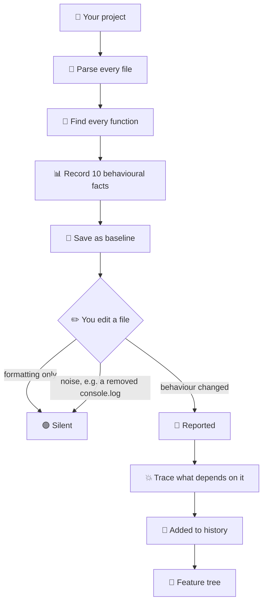

<div align="center">

# PlanMap

### Reads your codebase, learns what every function does,<br>and tells you what breaks when that changes.

Local · no rules to write · no spec to maintain · works on any repo

[](LICENSE)
[](https://nodejs.org)
[](#what-gets-tracked)
[](#status)

</div>

<div align="center">

---

## Three things it does

</div>

<table>
<tr>
<td width="33%" valign="top">

### 🔴 Detects behavioural change

Not "this file changed" — **this function stopped throwing**.

Reformat or rename → silent.
Remove error handling → reported.

</td>
<td width="33%" valign="top">

### 💥 Tells you what breaks

Traces which other functions depend on the one that changed, and how far the damage reaches.

Honest about what's proven and what's inferred.

</td>
<td width="33%" valign="top">

### 🌲 Builds a feature history

Turns those changes into a readable tree, grouped by
**what the feature does** — not which folder it's in.

</td>
</tr>
</table>

<div align="center">

---

## The change that started this

</div>

```diff
  function validateScore(raw) {
-   if (raw == null) throw new ValidationError('score required');
+   if (raw == null) return null;
    return Number(raw);
  }
```

<div align="center">

**Compiler passed · Tests passed · ESLint passed · AI review said nothing**

Every caller that relied on catching that error now silently receives `null`.
Nothing crashes. The behaviour is just wrong from here on.

---

## Install

</div>

```bash
npx planmap init        # learn the codebase
npx planmap watch       # report behavioural changes as they happen
npx planmap check       # one-off check, exits non-zero on real change
```

<div align="center">

**No API key · No account · No config · Nothing leaves your machine**

---

## How it works

</div>



<div align="center">

---

## What it looks like

</div>

**A behavioural change, with its blast radius**

```console
$ planmap check .

PlanMap Check

Changes: 1
Significant: 1
Insignificant: 0

  src/auth/token.ts::verifyToken:function CHANGED
      throws           1 → 0
      throwTypes       [AuthError] → []
      returnsNullish   0 → 1

Impact analysis:

src/auth/token.ts::verifyToken:function
  depth 1  src/auth/session.ts::loadSession:function   [call/inferred]
  depth 2  src/orders/create.ts                        [import/certain]
  depth 2  src/orders/create.ts::createOrder:function  [call/inferred]
  depth 3  src/api/routes.ts::handleOrder:function     [call/inferred]
```

Exit code `1`. In CI, that fails the build.

**A deleted function reports what will now break**

```console
  src/auth/token.ts::verifyToken:function DELETED

Impact analysis:
  depth 1  src/auth/session.ts::loadSession:function   [call/unresolved]
```

**Feature history** — `planmap evolution`

```markdown
- **Login**
  - Added authentication start endpoint  `backend` `api`
    - Updated authentication response status
      - numbers [200,401] → [200,402]
  - Added JWT verification middleware  `backend` `security`
  - Added Google Sign-In initialization  `frontend`

- **Survey**
  - Added survey start endpoint  `backend` `api`
  - Added survey submission service  `backend` `database`
```

<div align="center">

---

## Impact analysis

**Which functions break when this one changes.**

</div>

PlanMap reads your `import` statements to work out which file each call actually points at. If two files both export `validate`, it knows which one you meant.

It is explicit about certainty, and never guesses:

| | |
|:--|:--|
| **certain** | Traced through a real import — proven |
| **inferred** | Names match, but not proven |
| **unresolved** | Can't tell — dynamic dispatch, external package |

A confidently wrong answer is worse than an admitted gap, because you would act on it.

Handles named, default, and namespace imports, CommonJS `require`, destructured `require`, and re-exports. External packages and missing modules are reported as `unresolved` with a reason, never as broken internal dependencies.

<div align="center">

---

## Sessions

**Five saves on one function is one piece of work, not five.**

</div>

PlanMap collects your saves and closes the batch when you `git commit` — or after 30 minutes idle, or once 20 functions have been touched.

```
you saved:   200 → 201 → 202 → 203
it records:  200 → 203        (eventCount: 3)
```

Change something and change it back in the same session, and **nothing is recorded**. You tried something and undid it.

Sealing never advances the baseline. A commit is not an approval — only `accept` is.

<div align="center">

---

## Significance

**Removing a `console.log` is a real change. It is not a change worth interrupting you for.**

</div>

Always significant — these change the contract a caller depends on:

```
throws · throwTypes · returns · returnsNullish
catches · emptyCatches · params · awaits
```

Conditional: a `calls` change is noise only if **every** added and removed call is on the noise list. Remove a `console.log` *and* a `throw` in one edit and the whole change is significant.

Configure it in `.planmap/config.json`:

```json
{
  "significance": {
    "noiseCallPrefixes": ["console.", "logger.", "debug."]
  }
}
```

Nothing is ever discarded. Everything is recorded; significance is a filter applied when reading. `planmap check --all` shows what was filtered.

<div align="center">

---

## Commands

| | |
|:--|:--|
| `init` | Scan the project and write `.planmap/baseline.json` |
| `watch` | Watch files; report changes as they happen |
| `check` | Compare against the baseline. Exits non-zero on significant change. |
| `check --all` | Include insignificant changes |
| `accept` | Approve the current state as the new baseline |
| `seal` | Close the open session manually |
| `status` | Show pending sessions |
| `evolution` | Render the change history as a feature tree |
| `name` | Label the history with an LLM — **the only command that costs money** |
| `diff <a> <b>` | Compare two files directly |

> Only `init` and `accept` ever write the baseline. The watcher never does —
> otherwise a change would erase its own evidence.

---

## What gets tracked

**JavaScript · TypeScript · JSX · TSX** — ten facts per function

| | |
|:--|:--|
| `throws` · `throwTypes` | Error handling removed or changed |
| `returns` · `returnsNullish` | A function that threw now returns nothing |
| `calls` | A dependency added or dropped |
| `numbers` | Limits, timeouts, retries, status codes |
| `awaits` | Sync/async behaviour changed |
| `catches` · `emptyCatches` | Errors newly swallowed |
| `params` | Signature changed |

**String text is not recorded** — error messages get reworded constantly
and would create false alarms.

</div>

<details>
<summary><b>Why facts and not hashes?</b></summary>

<br>

| Edit | Hash | Facts |
|:--|:--:|:--:|
| Reformat | 🔴 fires | 🟢 silent |
| Rename a local | 🔴 fires | 🟢 silent |
| Add a comment | 🔴 fires | 🟢 silent |
| `throw` → `return null` | 🔴 fires | 🔴 `throws: 1 → 0` |

A hash tells you *something* changed. Facts tell you **what**.

</details>

<details>
<summary><b>TypeScript specifics</b></summary>

<br>

`.ts` and `.tsx` use separate grammars — in `.tsx`, `<Foo>` is JSX;
in `.ts` it's a type assertion.

Handled: classes, abstract classes, namespaces, decorators, generics,
overloads, getters and setters, `static` and `#private` members,
parameter properties, `satisfies`, and class fields holding functions.

`.d.ts` files are skipped, as are `dist`, `build`, `out`, and `.next` —
otherwise compiled output gets parsed alongside its source.

</details>

<details>
<summary><b>Files on disk</b></summary>

<br>

| File | Written by | Recoverable |
|:--|:--|:--|
| `baseline.json` | `init`, `accept` only | Yes — rescan |
| `events.jsonl` | `check`, `watch` | **No — the one irreplaceable artifact** |
| `sessions.json` | `watch`, `seal` | Yes — rebuilt from events |
| `graph.json` | `check` | Yes — safe to delete |
| `evolution.json` | `evolution`, `name` | Yes — replay events |

All plain JSON in `.planmap/`. A truncated or malformed file is reported
and skipped, never fatal.

</details>

<div align="center">

---

## Validated on real code

Run across **9 open-source TypeScript repositories**

**16,328** declarations · **0** identity collisions · **9/9** repos scanned

*TanStack Query · tRPC · Zod · Remeda · type-fest · got · ky · Zustand · ofetch*

A file that fails to parse is skipped and reported — never fatal.
One unsupported construct does not cost you the other 900 files.

---

## How it compares

| | Linters | AI reviewers | **PlanMap** |
|:--|:--:|:--:|:--:|
| Needs rules | ✅ | ❌ | ❌ |
| Sees between commits | ❌ | ❌ | **✅** |
| Sends code to a server | ❌ | ⚠️ | **❌** |
| Deterministic | ✅ | ❌ | **✅** |
| Knows what the code did yesterday | ❌ | ❌ | **✅** |

A pattern-matching scanner catches the example above **only if someone
wrote a rule** saying that function must throw. Nobody writes that rule.

---

## What it is not

**Not a linter** — no opinion about whether your code is good

**Not an AI reviewer** — static analysis decides what happened, not a model

**Not a security scanner**

**Not a spec tool** — nothing to write, nothing to maintain

---

## Status

**v0.5** — working, in active development, dogfooded daily

| | |
|:--|:--|
| ✅ | Declaration extraction — JS, TS, JSX, TSX |
| ✅ | Behavioural fact extraction |
| ✅ | Baseline · watch · CI exit codes |
| ✅ | Sessions — saves grouped into units of work |
| ✅ | Significance — noise filtered, configurable |
| ✅ | Dependency map — imports resolved with confidence tiers |
| ✅ | Impact analysis — what breaks when something changes |
| ✅ | Evolution graph with batched labelling |
| 🔨 | Intent — say what a function *should* do, and verify it |
| 📋 | Visual plan graph |
| 📋 | Python |

**Next release** adds the half PlanMap is missing

</div>

```console
  src/auth/token.ts::verifyToken:function  DRIFTED
    intent     Must throw on an invalid token. Callers rely on it.
    approved   12 days ago
    violation  throws — expected >= 1, actual 0
```

<div align="center">

Today PlanMap knows what your code **does**.
Next it will know what your code was **supposed to do**.

---

## Tech

Node ESM, no build step · [`web-tree-sitter`](https://github.com/tree-sitter/tree-sitter) for parsing · `chokidar` for watching
Storage is plain JSON in `.planmap/`, committable to git

Design decisions and reasoning: [`DECISIONS.md`](DECISIONS.md)

---

## Contributing

Issues welcome — especially

> 🐛 **A behavioural change PlanMap missed**
> 🔇 **A change it reported that didn't matter**

---

<br>

**BUSL-1.1** · built by the PlanMap team

</div>