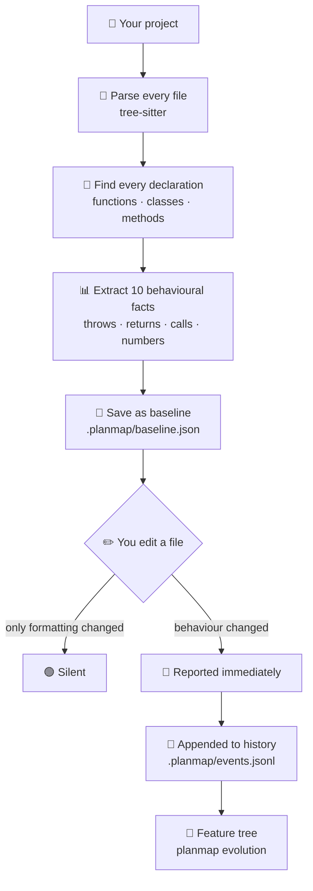

<div align="center">

# PlanMap

### Catches the code changes that compile, pass tests, and pass review.

Local · no rules to write · no spec to maintain · works on any repo

[](LICENSE)
[](https://nodejs.org)
[](#what-gets-tracked)
[](#status)

</div>

<div align="center">

---

## The change that started this

</div>

```diff
  function validateScore(raw) {
-   if (raw == null) throw new ValidationError('score required');
+   if (raw == null) return null;
    return Number(raw);
  }
```

<div align="center">

| | |
|:--|:--|
| ✅ Compiler | passed |
| ✅ Tests | passed |
| ✅ ESLint | passed |
| ✅ AI code review | said nothing |

Every caller that relied on catching that error now silently receives `null`.

**Nothing crashes. The behaviour is simply wrong from that point on.**

> This is the class of change PlanMap exists to catch.
> Not syntax errors — those are already handled.
> Behavioural changes that survive every existing layer of verification.

---

## In one sentence

### PlanMap remembers what every function in your code *did*,<br>and tells you when that changes.

Even if the code still compiles, still passes tests,<br>and still looks fine in review.

---

## How it works

</div>



<div align="center">

---

# 🔍 Phase 1 — Learn

### `planmap init .`

</div>

**Step 1 · Find your source files**
Walks every folder, skipping `node_modules`, `.git`, `dist`, `build`, `out`, `.next`. Finds every `.js`, `.jsx`, `.ts`, `.tsx`. Skips `.d.ts` — type declarations have no behaviour to track.

**Step 2 · Read each file properly**
Builds a real syntax tree with tree-sitter — not text matching. Picks the right grammar for JavaScript, TypeScript, or TSX. If one file can't be parsed, it says so and **keeps going** with the rest.

**Step 3 · Find every declaration**
Functions, classes, methods, getters, setters, arrow functions, class fields. Each gets a unique name based on where it lives:

```
src/auth/token.ts::UserService.validate:method
```

Handles the tricky cases — `static` vs instance, `#private`, namespaces, abstract classes. If two would collide, the second gets `#2` so neither is lost.

**Step 4 · Extract the behavioural facts**
Ten facts per declaration. See [the table below](#what-gets-tracked).

**Step 5 · Save the baseline**
Written to `.planmap/baseline.json`. **No line numbers** — those churn constantly and would cause false alarms. Commit it to git like any other file.

<div align="center">

---

# 👀 Phase 2 — Watch

### `planmap watch .` · `planmap check .` · `planmap accept .`

</div>

**Step 6 · Watch for behavioural changes**
Every save re-reads the file and compares facts against the baseline.

> 🟢 Only formatting changed → **says nothing**
> 🔴 Behaviour changed → **tells you immediately**

```console
src/auth/token.ts::verifyToken:function CHANGED
    throws           1 → 0
    throwTypes       [AuthError] → []
    returnsNullish   0 → 1
```

**Step 7 · Or check on demand**
Same comparison, once instead of continuously. Exits `1` if anything changed, `0` if nothing did — so it works in CI.

**Step 8 · Record the history**
Every real change is appended to `.planmap/events.jsonl`. Append-only, never rewritten. Both `watch` and `check` write to it. A corrupted line is skipped with a warning instead of crashing.

**Step 9 · Approve when you're ready**
`accept` makes the current state the new baseline.

> ⚠️ **Only `init` and `accept` ever write the baseline.**
> The watcher never does — otherwise a change would erase its own evidence.

<div align="center">

---

# 🌲 Phase 3 — Remember

### `planmap evolution .`

</div>

**Step 10 · Build the feature tree**
Reads the recorded events, groups them by directory, splits into batches of 30, and asks an LLM to write readable labels. Vocabulary threads forward so batch 5 reuses names from batch 1. Each batch is saved as it completes — a failure halfway doesn't lose earlier work, and re-running picks up where it stopped.

```markdown
- **Login**
  - Added authentication start endpoint  `backend` `api`
    - Updated authentication response status
      - numbers [200,401] → [200,402]
  - Added JWT verification middleware  `backend` `security`

- **Survey**
  - Added survey start endpoint  `backend` `api`
  - Added survey submission service  `backend` `database`
```

<div align="center">

Features are **capabilities, not layers** —
a feature spanning frontend and backend stays one node.

**Without an API key it still works** — labels fall back to
deterministic values derived from the code itself.

### 🔒 PlanMap never sends your source code anywhere.

Only extracted facts — `calls: [jwt.sign]`, `numbers: [3600] → [7200]` —
and only if you enable labelling.

---

## Install

</div>

```bash
npx planmap init      # scan the project, write a baseline
npx planmap watch     # watch for behavioural changes
```

<div align="center">

### No API key · No account · No config<br>Nothing leaves your machine

---

## Commands

| | |
|:--|:--|
| `init` | Scan the project and write `.planmap/baseline.json` |
| `watch` | Watch files; report behavioural changes as they happen |
| `check` | Compare against the baseline. Exits non-zero — usable in CI. |
| `accept` | Approve the current state as the new baseline |
| `diff <a> <b>` | Compare two files directly |
| `evolution` | Render the change history as a feature tree |

---

## What gets tracked

**JavaScript · TypeScript · JSX · TSX**

Ten facts per declaration

| Fact | What it catches |
|:--|:--|
| `throws` | How many times it throws an error |
| `throwTypes` | Which error types |
| `returns` | How many return statements |
| `returnsNullish` | How many return `null` or `undefined` |
| `calls` | What other functions it calls |
| `numbers` | Limits, timeouts, retries, status codes |
| `awaits` | How many `await`s |
| `catches` | How many `catch` blocks |
| `emptyCatches` | Catch blocks that silently swallow errors |
| `params` | How many parameters |

**String text is deliberately not recorded** —
error messages get reworded constantly and would create false alarms.

<details>
<summary><b>Why facts and not hashes?</b></summary>

<br>

| Edit | Hash | Facts |
|:--|:--:|:--:|
| Reformat | 🔴 fires | 🟢 silent |
| Rename a local | 🔴 fires | 🟢 silent |
| Add a comment | 🔴 fires | 🟢 silent |
| `throw` → `return null` | 🔴 fires | 🔴 `throws: 1 → 0` |

A hash tells you *something* changed. Facts tell you **what**.

</details>

<details>
<summary><b>How nested declarations are handled</b></summary>

<br>

Extraction stops at the boundary of the next declaration,
so each one owns only its own body.

Without this, one nested change would make every enclosing function
report as changed.

</details>

<details>
<summary><b>TypeScript specifics</b></summary>

<br>

`.ts` and `.tsx` use separate grammars — in `.tsx`, `<Foo>` is JSX;
in `.ts` it's a type assertion.

Handled: classes, abstract classes, namespaces, decorators, generics,
overloads, getters and setters, `static` and `#private` members,
parameter properties, `satisfies`, and class fields holding functions.

`.d.ts` files are skipped, as are `dist`, `build`, `out`, and `.next` —
otherwise compiled output gets parsed alongside its source.

</details>

---

## Validated on real code

Run across **9 open-source TypeScript repositories**

| | |
|:--|:--|
| **16,328** | declarations parsed |
| **0** | identity collisions |
| **9 / 9** | repositories scanned successfully |

*TanStack Query · tRPC · Zod · Remeda · type-fest · got · ky · Zustand · ofetch*

A file that fails to parse is skipped and reported — never fatal.
One unsupported construct does not cost you the other 900 files.

---

## How it compares

| | Linters | AI reviewers | **PlanMap** |
|:--|:--:|:--:|:--:|
| Needs rules | ✅ yes | ❌ no | ❌ no |
| Needs a spec | ❌ no | ❌ no | ❌ no |
| Sees between commits | ❌ no | ❌ no | **✅ yes** |
| Sends code to a server | ❌ no | ⚠️ yes | **❌ no** |
| Deterministic | ✅ yes | ❌ no | **✅ yes** |
| Knows what the code did yesterday | ❌ no | ❌ no | **✅ yes** |

A pattern-matching scanner catches the example at the top
**only if someone wrote a rule** saying that function must throw.

Nobody writes that rule.

**PlanMap catches it because it remembers what the function did yesterday.**

---

## What it is not

**Not a linter** — no opinion about whether your code is good

**Not an AI reviewer** — static analysis decides what happened, not a model

**Not a security scanner**

**Not a spec tool** — nothing to write, nothing to maintain

---

## Status

**v0.4** — working, in active development, dogfooded daily

| | |
|:--|:--|
| ✅ | Declaration extraction — JavaScript, TypeScript, JSX, TSX |
| ✅ | Behavioural fact extraction |
| ✅ | Baseline · diff · watch · CI exit codes |
| ✅ | Change history and feature tree |
| 🔨 | Sessions — group saves into one unit of work |
| 🔨 | Significance filtering — stop reporting removed debug lines |
| 🔨 | Dependency map — what calls what |
| 🔨 | Impact analysis — what a change affects downstream |
| 📋 | Python |

**Next release** adds the line the tool is missing today

</div>

```console
  3 declarations depend on this:
    loadSession     direct
    createOrder     direct
    handleOrder     via loadSession
```

<div align="center">

---

## Tech

Node ESM, no build step
[`web-tree-sitter`](https://github.com/tree-sitter/tree-sitter) (WASM) for parsing · `chokidar` for watching
Storage is plain JSON in `.planmap/`, committable to git

Design decisions and their reasoning: [`DECISIONS.md`](DECISIONS.md)

---

## Contributing

Issues welcome — especially these two

> 🐛 **A behavioural change PlanMap missed**
>
> 🔇 **A change it reported that didn't matter**

Both are more useful than feature requests right now.

---

<br>

**MIT** · built by [@its-sambhav](https://github.com/its-sambhav)

</div>
