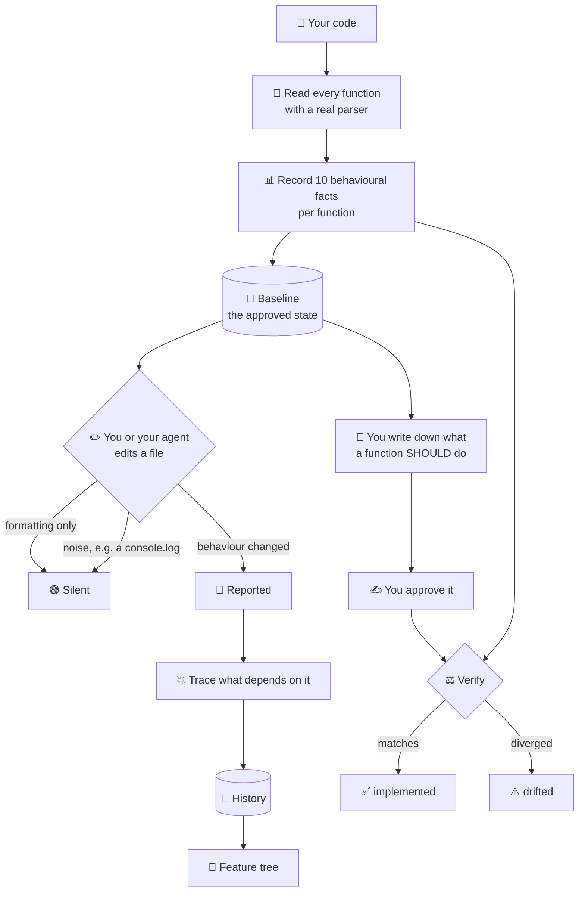

<div align="center">

# PlanMap

### Your agent writes the code.<br>PlanMap makes sure it wrote what you approved.

Local · no rules to write · no spec to maintain · works on any JS/TS repo

[](LICENSE)
[](https://nodejs.org)
[](#what-gets-tracked)
[](#status)

</div>

<div align="center">

---

## The problem

</div>

Here is a two-line change an AI assistant might make:

```diff
  function validateScore(raw) {
-   if (raw == null) throw new ValidationError('score required');
+   if (raw == null) return null;
    return Number(raw);
  }
```

<div align="center">

**Compiler passed · Tests passed · ESLint passed · AI review said nothing**

</div>

Every caller that relied on catching that error now silently receives `null`.
Nothing crashes. The behaviour is simply wrong from here on.

This is the most common way AI-written code fails. Not crashes — **silent behaviour
changes that look reasonable in isolation.**

<div align="center">

---

## The idea

</div>

Software has two sides:

<table>
<tr>
<td width="50%" valign="top">

### 📐 Intent

**What you meant it to do.**

You write it down once, in plain words, and approve it:

> *"This must throw on an invalid token.
> Callers rely on the exception."*

</td>
<td width="50%" valign="top">

### 🔬 Reality

**What the code actually does.**

PlanMap reads your real code and records
the facts — does it throw, does it return
null, what does it call, what limits does
it enforce.

</td>
</tr>
</table>

<div align="center">

They start the same and slowly drift apart.
**PlanMap keeps them tied together and tells you the moment they diverge.**

---

## Try it

</div>

```bash
npx planmap init .        # learn the codebase
npx planmap check .       # what changed?
npx planmap verify .      # does it still match what you approved?
```

<div align="center">

**No API key · No account · No config · Nothing leaves your machine**

---

## What it looks like

</div>

**Something changed:**

```console
$ planmap check .

PlanMap Check

Changes: 1     Significant: 1     Insignificant: 0

  src/auth/token.ts::verifyToken:function CHANGED
      throws           1 → 0
      throwTypes       [AuthError] → []
      returnsNullish   0 → 1

Impact analysis:
  depth 1  src/auth/session.ts::loadSession:function   [call/inferred]
  depth 2  src/orders/create.ts                        [import/certain]
  depth 3  src/api/routes.ts::handleOrder:function     [call/inferred]
```

**And it broke a promise you made:**

```console
$ planmap verify .

PlanMap Verify

Approved: 12   Verified: 11   Drifted: 1   Errors: 0

DRIFTED
  src/auth/token.ts::verifyToken:function
    Intent: Must throw on an invalid token. Callers rely on the exception.
    Approver: Sambhav Jain
    Approved: 12 days ago
    Violation: throws does not satisfy >=

    3 declarations depend on this:
      loadSession    direct           inferred
      createOrder    direct           inferred
      handleOrder    via loadSession  inferred
```

<div align="center">

Exit code `1`. In CI, that fails the build.

**No other tool can print that middle line** — *"you approved that this must throw."*

---

## How it works

</div>



<div align="center">

---

## The five things it does

</div>

### 1 · Reads your code properly

Not by searching text. A real parser (tree-sitter) that understands
**JavaScript, TypeScript, JSX, and TSX** — classes, private `#` members, namespaces,
decorators, generics, getters and setters.

Every function gets a stable, unique name:

```
src/auth/token.ts::UserService.validate:method
```

*Validated on real projects — zod (2,449 declarations), ky (547), zustand (428).
**Zero naming collisions.***

### 2 · Records what each function *does*

Ten facts per function:

| | |
|:--|:--|
| `throws` · `throwTypes` | Does it raise errors, and which kinds |
| `returns` · `returnsNullish` | Does it return nothing |
| `calls` | What it depends on |
| `numbers` | Limits, timeouts, retries, status codes |
| `awaits` | Sync or async |
| `catches` · `emptyCatches` | Errors handled, or silently swallowed |
| `params` | Its signature |

**Text inside strings is deliberately ignored** — error messages get reworded
constantly and would create false alarms.

### 3 · Tells you when behaviour changes

- **Reformat, rename a variable, add a comment** → silent
- **Remove error handling, change a limit, swallow an exception** → reported

It also ignores noise. Delete a `console.log` and PlanMap stays quiet — a real
change, but not one worth interrupting you for. Configurable:

```json
{ "significance": { "noiseCallPrefixes": ["console.", "logger.", "debug."] } }
```

### 4 · Tells you what else breaks

PlanMap reads your `import` statements to work out which file each call actually
points at. If two files both export `validate`, it knows which one you meant.

It is explicit about certainty and never guesses:

| | |
|:--|:--|
| **certain** | Traced through a real import — proven |
| **inferred** | Names match, but not proven |
| **unresolved** | Can't tell — dynamic dispatch, external package |

> A confidently wrong answer is worse than an admitted gap, because you'd act on it.

### 5 · Checks the code against what you approved ⭐

This is the part nothing else does.

You write down what a function must do, and approve it:

```json
{
  "identity": "src/auth/token.ts::verifyToken:function",
  "intent": "Must throw on an invalid token. Callers rely on the exception.",
  "rules": [{ "assert": { "throws": { "op": ">=", "value": 1 } } }]
}
```

```bash
planmap approve .
```

From then on, `planmap verify` checks the real code against that decision.

**It is arithmetic, not an opinion.** No AI decides pass or fail — a model can't
gate a build. And PlanMap only ever checks rules a **human approved**, so an agent
that writes both the code and the intent can never mark its own homework.

<div align="center">

---

## Sessions — five saves is one piece of work

</div>

PlanMap collects your saves and closes the batch when you `git commit` — or after
30 minutes idle, or once 20 functions have been touched.

```
you saved:   200 → 201 → 202 → 203
it records:  200 → 203        (eventCount: 3)
```

Change something and change it back in the same session, and **nothing is recorded.**
You tried something and undid it.

<div align="center">

---

## A readable history

</div>

```bash
planmap evolution . --md
```

```markdown
- **Login**
  - ● Added JWT verification middleware  `backend` `security`
  - ⚠ Added remember me  `frontend`          ← drifted
  - ◌ Added promo code field                 ← planned, not built

- **Checkout**
  - ● Stripe integration  `backend`
  - ✕ Order confirmation email               ← linked code is broken
```

Generated from the code, so it can't fall out of date. Grouped by **what the
feature does**, not which folder it lives in.

<div align="center">

---

## Commands

</div>

**Getting started**

| | |
|:--|:--|
| `init <project>` | Scan and write the baseline |
| `check <project>` | What changed? Exits non-zero on significant change |
| `accept <project>` | Approve the current state as the new baseline |
| `watch <project>` | Watch continuously as you work |

**Intent**

| | |
|:--|:--|
| `plan draft <project>` | AI proposes rules by reading your code |
| `plan draft <project> --from "..."` | Draft from a description, before any code |
| `plan list` · `plan show <identity>` | Inspect the plan |
| `approve <project> [identity]` | Sign off a rule — `--all`, `--lens`, `--feature` |
| `reject <project> <identity>` | Remove a rule — `--force` if approved |
| `plan revise <project> <identity>` | Change your mind; the old version is archived |
| **`verify <project>`** | **Does the code still match what you approved?** |

**History**

| | |
|:--|:--|
| `evolution <project> [--md]` | Render the feature tree |
| `name <project>` | Label the history with an LLM — **the only command that costs money** |
| `status` · `seal` | Inspect and close the current session |

**Useful flags**

`--json` machine-readable · `--md` write a report file · `--verbose` show skipped files
`--lens <id>` check one lens · `--only drifted` filter output · `--strict` fail on unsupported rules

<div align="center">

---

## Exit codes

</div>

| Code | Meaning |
|:--:|:--|
| **0** | Everything verified |
| **1** | Something drifted or errored |
| **2** | Nothing to verify — no plan, or nothing approved |

> Code `2` matters. *"Nothing drifted"* and *"nothing was ever approved"* must never
> both look green, or a team runs on an empty plan for months believing they're covered.

<div align="center">

---

## Machine-readable output

</div>

```bash
planmap verify . --json
```

```json
{
  "schema": 1,
  "generatedAt": "2026-09-06T20:26:48.736Z",
  "project": "/your/project",
  "summary": { "approved": 12, "verified": 11, "drifted": 1, "errors": 0, "unsupported": 0 },
  "results": [
    {
      "identity": "src/auth/token.ts::verifyToken:function",
      "status": "drifted",
      "intent": "Must throw on an invalid token.",
      "approvedBy": "Sambhav Jain",
      "violations": [{ "field": "throws", "expected": 1, "actual": 0 }],
      "impact": [{ "identity": "...", "depth": 1, "confidence": "inferred" }]
    }
  ]
}
```

A stable, versioned contract. `--md` writes the same data to `VERIFY.md`,
committable alongside your code.

<div align="center">

---

## How it compares

| | Linters | AI reviewers | **PlanMap** |
|:--|:--:|:--:|:--:|
| Needs rules written first | ✅ | ❌ | ❌ |
| Sees changes between commits | ❌ | ❌ | **✅** |
| Sends your code to a server | ❌ | ⚠️ | **❌** |
| Deterministic | ✅ | ❌ | **✅** |
| Knows what the code did yesterday | ❌ | ❌ | **✅** |
| **Knows what you decided it should do** | ❌ | ❌ | **✅** |

</div>

A pattern-matching scanner catches the example at the top **only if someone wrote a
rule** saying that function must throw. Nobody writes that rule for every function.
PlanMap learns the current behaviour automatically, and you only write down the
handful of rules that actually matter.

<details>
<summary><b>Why facts and not hashes?</b></summary>

<br>

| Edit | Hash | Facts |
|:--|:--:|:--:|
| Reformat | 🔴 fires | 🟢 silent |
| Rename a local variable | 🔴 fires | 🟢 silent |
| Add a comment | 🔴 fires | 🟢 silent |
| `throw` → `return null` | 🔴 fires | 🔴 `throws: 1 → 0` |

A hash tells you *something* changed. Facts tell you **what**.

</details>

<details>
<summary><b>Files on disk</b></summary>

<br>

All plain JSON in `.planmap/`.

| File | Written by | Recoverable | Commit it? |
|:--|:--|:--|:--:|
| `baseline.json` | `init`, `accept` only | yes — rescan | ✅ |
| `events.jsonl` | `check`, `watch` | **no — the one irreplaceable file** | ✅ |
| `plan.json` | plan commands | **no — you wrote it** | ✅ |
| `sessions.json` | `watch`, `seal` | yes — rebuilt from events | ❌ |
| `graph.json` | `check` | yes — safe to delete | ❌ |
| `evolution.json` | `evolution`, `name` | yes — replay events | ❌ |

A truncated or malformed file is reported and skipped, never fatal.

**Two rules that shape everything:**

Only `init` and `accept` write the baseline — the watcher never does, or a change
would erase its own evidence.

Record everything; filter when reading. Nothing is discarded at extraction, so a
filter rule that turns out wrong can be changed without losing history.

</details>

<details>
<summary><b>TypeScript specifics</b></summary>

<br>

`.ts` and `.tsx` use separate grammars — in `.tsx`, `<Foo>` is JSX; in `.ts` it's a
type assertion.

Handled: classes, abstract classes, namespaces, decorators, generics, overloads,
getters and setters, `static` and `#private` members, parameter properties,
`satisfies`, and class fields holding functions.

`.d.ts` files are skipped, as are `dist`, `build`, `out`, and `.next` — otherwise
compiled output gets parsed alongside its source.

A file that fails to parse is skipped and reported. One unsupported construct does
not cost you the other 900 files. Run with `--verbose` to see which files were skipped.

</details>

<div align="center">

---

## What it is not

**Not a linter** — no opinion about whether your code is good

**Not an AI reviewer** — static analysis decides what happened, not a model

**Not a security scanner**

**Not a spec tool** — nothing to write upfront, nothing to keep in sync

---

## Status

**v0.6 — complete.** The full engine works end to end.

| | |
|:--|:--|
| ✅ | Declaration extraction — JS, TS, JSX, TSX |
| ✅ | Behavioural fact extraction |
| ✅ | Baseline · watch · CI exit codes |
| ✅ | Sessions — saves grouped into units of work |
| ✅ | Significance — noise filtered, configurable |
| ✅ | Dependency map — imports resolved with confidence tiers |
| ✅ | Impact analysis — what breaks when something changes |
| ✅ | Evolution graph with batched labelling |
| ✅ | **Intent — write down what code should do, and approve it** |
| ✅ | **Verification — deterministic drift detection** |
| ✅ | JSON + markdown reports |
| 📋 | Visual plan graph |
| 📋 | Editor and agent integration |
| 📋 | Python |

**22 test suites** · validated on zod, ky, and zustand · **0 identity collisions
across 3,424 declarations**

---

## Tech

Node ESM, no build step · [`web-tree-sitter`](https://github.com/tree-sitter/tree-sitter)
for parsing · `chokidar` for watching
Storage is plain JSON in `.planmap/`

Design decisions and the reasoning behind them: [`DECISIONS.md`](DECISIONS.md)

---

## Contributing

Issues welcome — especially

> 🐛 **A behavioural change PlanMap missed**
> 🔇 **A change it reported that didn't matter**

Both make the tool better in ways that are hard to find alone.

---

<br>

**MIT** · built by [@its-sambhav](https://github.com/its-sambhav)

</div>